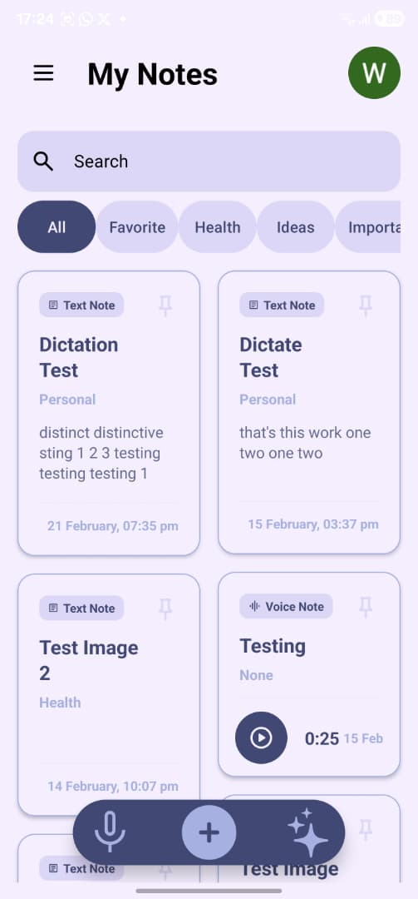
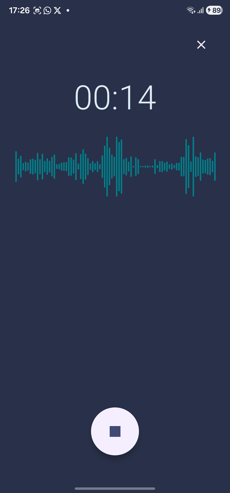
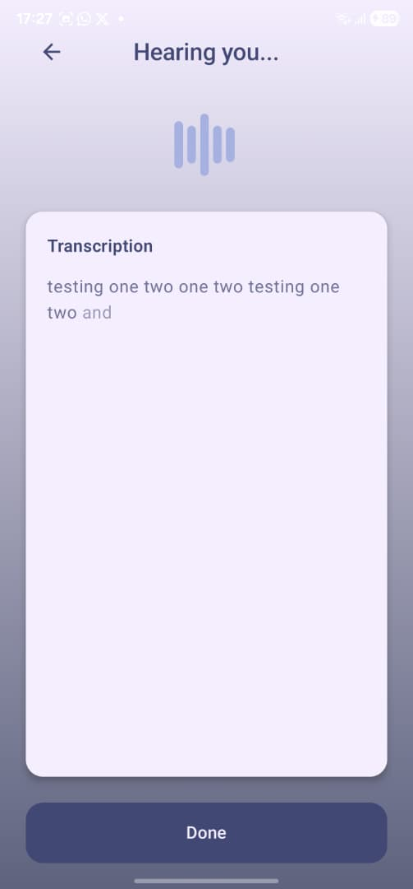

# EchoNoteX

EchoNoteX is a mobile note-taking application designed for simplicity, speed, and an intuitive user experience. 

The app was originally developed as part of mobile application development course for my BSWE program at Ndejje University. However, the project is being actively extended into a fully-featured personal productivity tool.

## 🚀 Overview

EchoNoteX focuses on providing a lightweight yet powerful note-taking experience. The goal is to balance clean UI/UX with practical functionality that support everyday note management.

This project serves both as:
- A learning artifact for mobile application development
- An evolving real-world application with incremental feature additions

## ✨ Features (Current & Planned)

### ✅ Core Features
- Create, edit, and delete notes
- Simple and clean user interface
- Local data persistence
- Voice features like voice notes and note transcription

### 🔄 In Progress / Under refinement
- Rich text editing refinement (embedding images within text notes)
- Search and filtering
- Cloud sync / backup via Firebase
- Authentication (user accounts) amd user account note persistence
- Local LLM integration via Llama.cpp
- AI-assisted note summary and refinement.

## 🛠️ Tech Stack


- **Platform:** Android (Kotlin)
- **UI:** Jetpack Compose + Android Views (hybrid, migration in progress)
- **Architecture:** MVVM (in progress)
- **Local Database:** Room
- **Cloud Backend:** Firebase Authentication, Cloud Firestore
- **AI / On-device Inference (Experimental, in progress):** llama.cpp

## 📱 Screenshots

> More screenshots will be added as the UI stabilizes.

### Splash Screen


### Home Screen


### Voice Record


### Note Transcribe


## ⚙️ Installation & Setup

Clone the repository:
   ```bash
git clone https://github.com/rw3h4/EchoNoteX-app.git
cd EchoNoteX-app
```
## ⭐ Contributing

Contributions, suggestions, and improvements are welcome!


